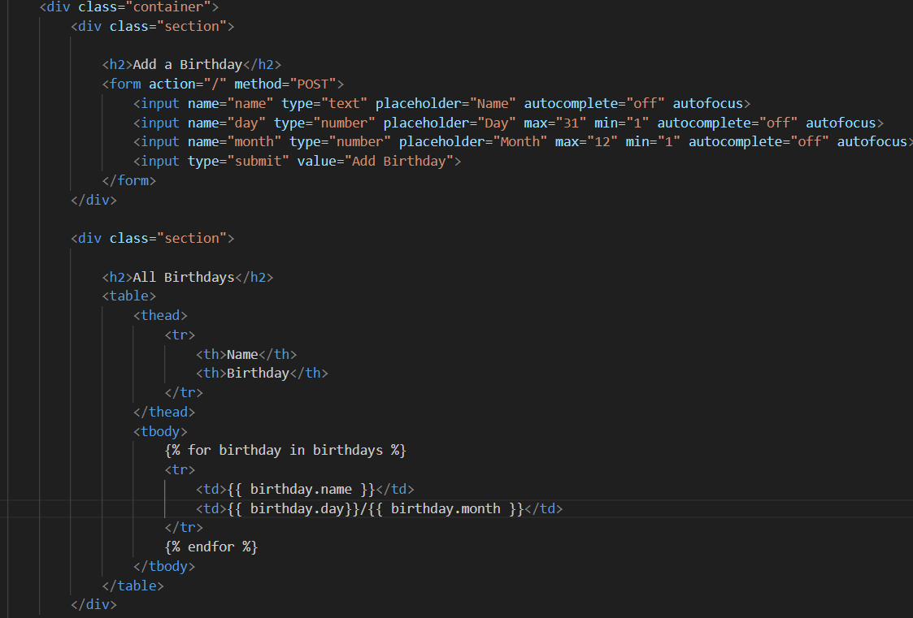
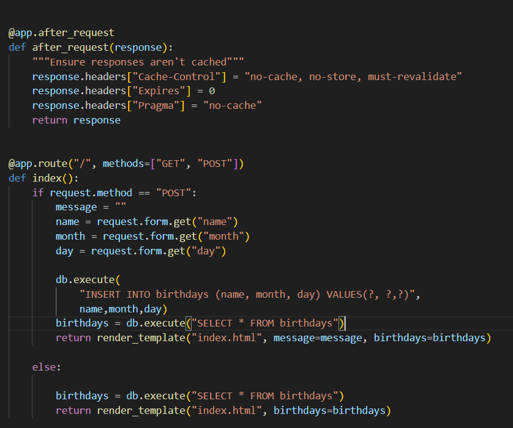
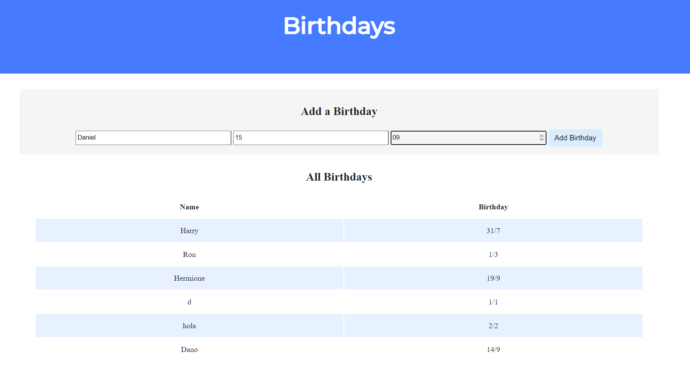
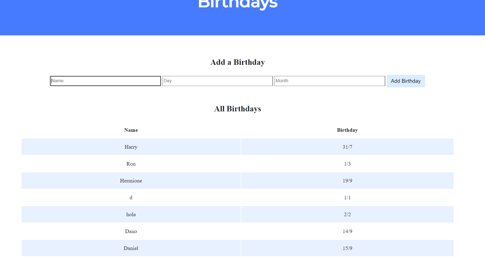

# Flask_Birthday

En este repositorio lo que tenemos es un gestor de cumpleaños, es decir una pagina la cual guarda los cumpleaños que le pongamos
---

En esta imagen podemos ver la parte del HTML que se encarga de gestionar las etiquetas y botones para añadir los cumpleaños que queramos y guardalo

Para guardar los cumpleaños lo hacemos en las casillas imputs creadas para ello, donde el input name es un texto, el input day es un numero entre 1 y 31 y el input Month es un numero entre 1 y 12
Para termianar este HTML hacemos un bucle for para todos los cumplaños guardados en la base de datos y creamos una fila en la tabla para cada cumpleaños asi, cuando añadimos un cumpleaños, nos redirije a la pagina asi que se añade el cumpleaños que hemos añadido al final de nuestra pagina

---

Aqui tenemos app.py la parte de python de este projecto, el cual lo que nos proporciona es toda la gestion sobre la base de datos, mediante el uso del boton para añadir cumpleaños, llama a la funcion index, esta al ser un post lo que hace es coger los datos de las variables introducidas en los inputs anteriores, el valor name, month y day con estos datos ejecutamos un insert a la base de datos con los datos dados. Finalmente volvemos a la misma pagina que ya teniamos index.html, lo que antes de volver hacemos un select de todos los cumpleaños de la tabla y le enviamos todos los cumpleaños, asi cuando volvamos a entrar a la pagina tendremos todos los cumpleaños en la parte inferior de nuestra pagina

---

Podemos ver aqui la pagina final donde he rellenado los parametros con mi nombre y mi cumpleaños el 15/9 se puede ver que abajo hay varias pruebas de antes con los cumpleaños de los personajes de Harry Potter ademas de d hola y dani que son otras pruebas que he ido aciendo mientras hacia el codigo para terminar y ahora le dare a add Birthday para que veais como despues sale al instante 

---

Ahora esta captura sale justo despues de darle al boton add birthday y se puede ver como al final sale mi nombre Daniel y mi cumpleaños el 15/9 que ya sale despues de darle al boton 

---

Para finalizar para ver todo el codigo completo se puede en el repositorio ya que no queria poner la parte de css que nos la dan directamente, he puesto las partes que he tenido que rellenar.
